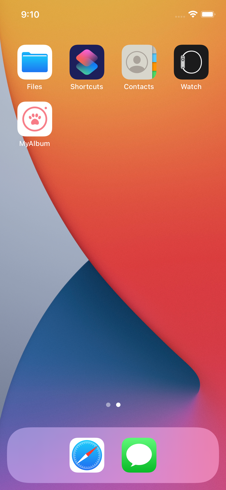
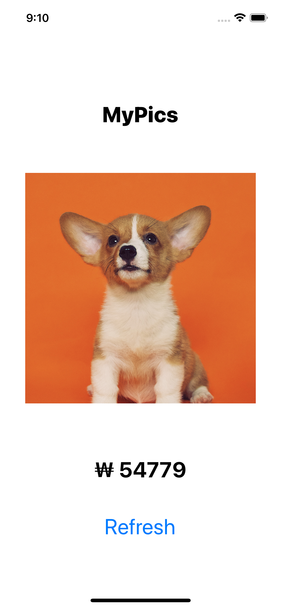
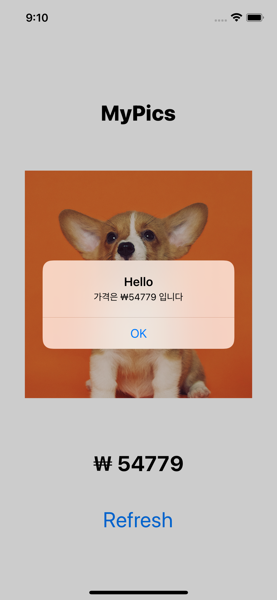

# MyAlbum

## 

## 목표

	1.  버튼 만들기
 	2.  버튼 눌러서 Alert 띄우기
 	3.  OK 버튼을 누를때마다 가격 수정
 	4.  아이콘 넣기

---

## Home




## Main



## Button




### String variable

```swift
var currentValue = 0
let message = "가격은 ₩ \(currentValue) 입니다"
```

> 이런 식으로 하면 String 안에 변수를 넣을 수 있다. 


